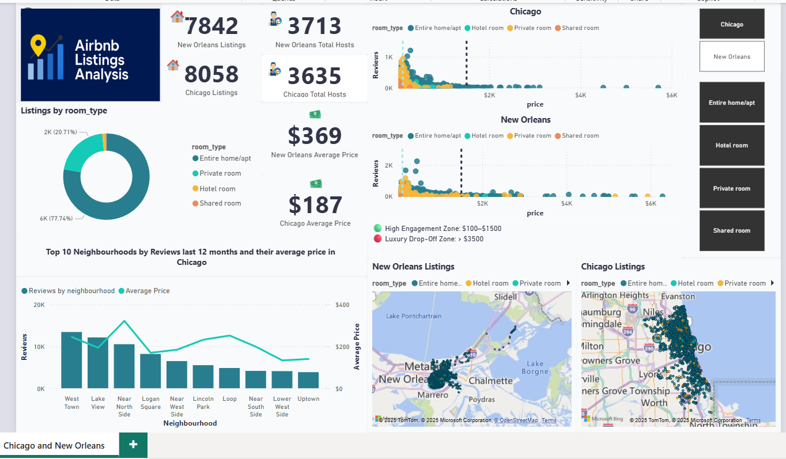

# Airbnb-Listings-Analysis
A comprehensive project has been developed based on the dataset from Airbnb Listings of two cities, New Orleans and Chicago.
This project involves data collection (from the web), data cleaning (using Power Query), data modeling, and data visualization (using Power BI).

**Dataset Selection:**
For this EDA project, we have chosen the "Airbnb Listings Data" dataset from 2 major cities: Chicago and New Orleans. This dataset provides a comprehensive snapshot of various attributes related to Airbnb listings, such as property type, neighbourhood, pricing, availability, and more. The dataset is ideal for conducting an in-depth exploration of the local Airbnb market and deriving actionable insights.

**Why Airbnb:**
Airbnb, a prominent online platform, enables individuals to reserve accommodations spanning a spectrum from beds and rooms to apartments and entire homes across global locales. This user-centric platform serves as a conduit for seamless property rentals, negating the need for intricate intermediaries or substantial capital outlays. Notably, users can secure lodgings at significantly competitive rates relative to traditional hotels. Distinctively, Airbnb extends its reach to regions where convectional hotel presence might be limited, offering an avenue for lodging acquisition in underserved locales. Moreover, the inclination towards immersive local experiences often steers individuals towards selecting accommodations embedded within native communities, fostering a distinctive preference for authenticity and cultural engagement.

Airbnb Statistics • Over 4 million listings worldwide • 150 million users in 191 countries • Worldwide value is $32 billion • Global growth rate since 2009 - 153%

📊 Download the Power BI File.

📈 Dashboard Preview

📌 Key Performance Indicators (KPIs)

